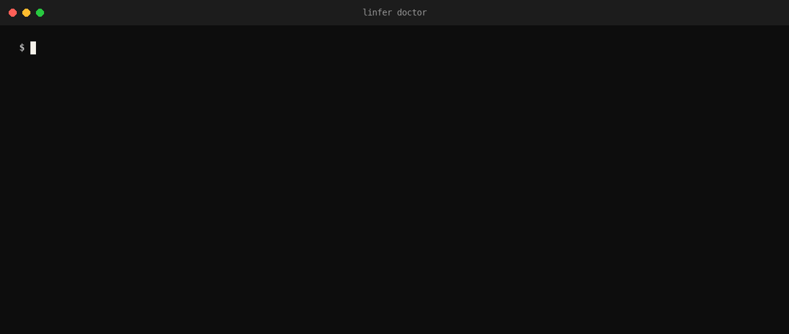

# linfer

[](https://github.com/sudiptadeb/linfer/actions/workflows/test.yml)
[](https://pkg.go.dev/github.com/sudiptadeb/linfer)
[](LICENSE)

**The best local inference setup for your machine, without the hassle.**

linfer looks at the hardware, installs the right backend (llama.cpp's
`llama-server`, or oMLX on Apple Silicon), fetches the weights, sizes the
launch to the memory left after them, runs the backend under supervision, and
tells your client one URL and one model id that never change. It is not a
proxy: requests go from your client straight to the backend's own
OpenAI-compatible `/v1` endpoint.

<p align="center">
  
</p>

## Why it exists

One model, the same 8-bit weights, three runtimes, on one 256 GB Apple
Silicon machine (a ~125B mixture-of-experts model; measured, not quoted):

| | Ollama 0.34 | llama.cpp, current | oMLX + multi-token prediction |
|---|---:|---:|---:|
| one agent: a replayed real agent call | 37.2 s | not run | **14.4 s** |
| eight agents × 33k context: combined tok/s | 52 | **104** | 85 |
| replayed tool calls valid | 50 / 52 | 52 / 52 | 52 / 52 |

The fastest runtime depends on the machine and on how many agents share it,
and the defaults most people start with leave a lot on the table. linfer
makes the choice, measures it with `linfer bench`, and lets you change your
mind with one command.

## What it does

- **Detects** the machine: OS and architecture; on Apple Silicon the chip,
  unified memory and the Metal working set; on Linux an NVIDIA (VRAM, CUDA
  version), AMD (ROCm) or Vulkan GPU, else CPU; RAM and free disk.
- **Installs the backend**: the official prebuilt llama.cpp release for the
  platform (macOS Metal; Linux CUDA, ROCm, Vulkan or CPU), pinned to a
  known-good build and verified with `--version`; on Apple Silicon also oMLX
  into its own virtualenv, pinned to a commit. A binary you already have is
  used as is.
- **Fetches the model** from a Hugging Face repo (a GGUF file, or a whole MLX
  repo) into its own directory, resumable, verified by size and sha256,
  after checking it fits on the disk and in memory. Local paths work too.
- **Picks and tunes**: `auto` is oMLX on Apple Silicon when MLX weights are
  available, else llama.cpp with the right GPU build. Slots, context per
  slot, prompt cache and concurrency are computed from the memory headroom;
  anything you set explicitly wins.
- **Serves**: launches the backend as a child, health-checks it, logs its
  memory, restarts it when it dies, and lets you pause it (freeing its
  memory for something else) and resume it without touching the service.

## Quick start

Build (Go 1.22 or later):

```sh
go build -o linfer ./cmd/linfer
```

Write `~/.config/linfer/linfer.yaml` (see the example below), then:

```sh
linfer setup     # install the backend, fetch the weights, print the URL and model id
linfer serve     # run it; put this under launchd or systemd for real use
linfer status    # in another shell
```

### macOS (Apple Silicon)

A config with both `gguf` and `mlx` weights lets `auto` choose oMLX; one with
only `gguf` runs llama.cpp with Metal. oMLX is installed from git into
`~/.local/share/linfer/venv-omlx` with a Python 3.11–3.13 (found on PATH, or
through `uv`). The Metal working set is measured through MLX once that venv
exists, and estimated before.

### Linux (NVIDIA, or CPU)

With `nvidia-smi` present, `setup` downloads the CUDA build matching the
driver's CUDA line (12.8 or 13.x) plus its runtime libraries; with no GPU
tool answering it takes the CPU build (set `gpu: vulkan` or `gpu: rocm` to
force those). The weights are sized against VRAM; the prompt cache against
system RAM.

## Example config

```yaml
# ~/.config/linfer/linfer.yaml
backend: auto                 # auto | llama | mlx
listen: 127.0.0.1:8090        # the backend's address; the client's base_url is http://127.0.0.1:8090/v1

model:
  id: qwen3-coder:30b-q8_0    # what the client names; the same on every backend
  gguf: hf://Qwen/Qwen3-Coder-30B-A3B-Instruct-GGUF/Qwen3-Coder-30B-A3B-Instruct-Q8_0.gguf
  # mmproj: hf://…            # a vision projector, if the model has one
  # mlx: hf://mlx-community/Qwen3-Coder-30B-A3B-Instruct-8bit   # lets auto pick oMLX on Apple Silicon
  # slots: 8                  # llama-server parallel slots; 0 = auto
  # context: 131072           # tokens per slot; 0 = auto
  reasoning_effort: medium    # passed to the chat template

# Binaries: empty means linfer's own install under dir.
# llama_bin: /usr/local/bin/llama-server
# omlx_bin: ~/venv-omlx/bin/omlx
# llama_release: b11429
# gpu: cuda                   # Linux override: cuda | rocm | vulkan | cpu
# dir: /big-disk/linfer       # weights, binaries, state and the control socket; default ~/.local/share/linfer
# keep_free_gb: 200           # a download must leave this much disk free
# cache_ram_mb: 0             # llama-server --cache-ram; 0 = auto
# max_concurrent: 0           # oMLX --max-concurrent-requests; 0 = auto (at most 6)
```

Paths may start with `~`. An `hf://org/repo/file` reference is a GGUF file;
`hf://org/repo` is a whole MLX repo. Set `HF_TOKEN` for gated repos.

## Commands

| command | what it does |
|---|---|
| `linfer setup` | detect, install what is missing, fetch the weights, size the launch, print the URL and model id |
| `linfer doctor [--json]` | the same report without changing anything |
| `linfer serve` | run the backend under supervision; this is the service |
| `linfer status [--json]` | backend, URL, model id, pid, healthy, RSS, restarts |
| `linfer pause` | stop the backend and free its memory; the daemon stays up |
| `linfer resume` | start it again |
| `linfer switch llama\|mlx\|auto` | change backend for this daemon's lifetime and restart the child |

`-config FILE` before the command names another config. `serve` talks to
`status`, `pause`, `resume` and `switch` over a unix socket under `dir`, so
only the user who owns that directory can pause the model.

## How selection and sizing work

**Backend.** `auto` is oMLX only on darwin/arm64 when the model has `mlx`
weights that are present and an `omlx` binary exists; everything else is
llama.cpp. `doctor` prints the reason.

**Budget.** On Apple Silicon the budget is the Metal working set (measured
through MLX, else the `iogpu.wired_limit_mb` sysctl, else an estimate of 87%
of RAM, which is what macOS gave a 256 GB machine); on CUDA and ROCm it is
the card's VRAM; otherwise 80% of RAM. Weights that do not fit in the budget
less a 4 GiB reserve are refused before anything is downloaded.

**llama.cpp.** From the headroom (budget − weights − reserve): the prompt
cache (`--cache-ram`) is half the headroom, at most 16 GiB, or a quarter of
system RAM on a discrete GPU; slots start at 8 (budget ≥ 64 GiB), 4 or 2;
context per slot starts at the smaller of the model's context and 131,072.
The KV cache a token costs is read from the GGUF header (attention layers ×
KV heads × head size × 2 bytes × K and V; hybrid models count only their
full-attention layers). While slots × context × KV exceeds what is left,
context halves down to 32k, then slots halve, then context halves down to
8k. The rest of the launch profile is fixed and measured: 4 restore points
per slot, flash attention, `--jinja`, batch 2048 / micro-batch 512, the
model's own sampling, no speculative decoding.

**oMLX.** The context window is the model's; concurrency is the headroom
divided by one full window of KV, at most 6. `model_settings.json` gets
multi-token prediction, the model pinned, the same sampling, and the
reasoning effort.

Every explicit value in the config overrides its computed one, and a
configuration past the budget runs as told with a warning in the report.

## Benchmark your machine

```sh
linfer bench --quick                       # a few minutes: both backends, one run per cell
linfer bench                               # the default profile: 2 runs per cell, 2k and 8k contexts, 1/2/4 streams
linfer bench --full --tag before-upgrade   # 3 runs, 2k and 32k, 1/2/4/8 streams, tagged for a later comparison
linfer bench --backends llama --suites speed --contexts 2k,32k --concurrency 1,8 --out ./bench
```

`bench` runs every backend this machine can run for the configured model
(`--backends all`, or a list), **one at a time**, each launched with exactly
the profile `serve` would use: load, warm up, measure, stop, wait for the
exit so the memory is free, then the next. If a `linfer serve` daemon for
this config is running it is paused over the control socket first and
resumed at the end, also on Ctrl-C or an error. The measuring is done by
[linfer-bench](https://github.com/sudiptadeb/linfer-bench), which linfer
hands each backend's URL, model id and context limit; its three suites are:

- **speed**: for each context size and concurrency level, a cold pass (one
  token per prompt, every prompt sent at once) for time to first token and
  prefill, then after a short settle a warm pass on the now-cached prompts
  for decode per stream, combined tok/s and the warm time to first token:
  the shape of an agent's turn. Measured on the client from the stream, the
  same way for every backend; the backend's own figures (llama-server's
  `timings`, oMLX's `usage`) sit beside them with the stream's granularity
  in tokens per chunk. Medians of N runs, with the range.
- **tools**: nine tool-calling cases over generic schemas, scored for valid
  JSON, the right tool, schema-valid arguments, no call when none is
  needed, two calls in one turn, a follow-up after a tool result, an id
  copied exactly as a string, leaked markup and HTTP errors. Your own cases
  go in with `--cases FILE`; the format is in linfer-bench's README.
- **context**: needle-in-haystack at several depths, at each context size
  up to the slot's.

The flags are linfer-bench's: `--quick` or `--full` pick the profile,
`--contexts`, `--concurrency`, `--runs`, `--reply-tokens`, `--tool-passes`
and `--suites` override it, `-f bench.yaml` takes the options from a file
(its targets are ignored: linfer starts the backends), and `--tag` tags the
run. Each backend's row is also tagged `backend:<name>`, and the run is kept
in linfer-bench's store, so a before and after is one command away:

```sh
linfer bench --quick --tag before
# upgrade llama.cpp, or switch the MLX weights
linfer bench --quick --tag after
linfer-bench compare --tags before,after          # or --tags backend:llama,backend:mlx
```

It prints a comparison table with a short verdict, and writes `results.json`,
`report.md` and a self-contained `report.html` (charts, sortable tables,
light and dark) to `--out` (default `<dir>/bench/<timestamp>`). The verdict
names the fastest single stream, the most combined output at the top
concurrency, tool accuracy per backend and any failures, and says when a
difference is within the runs' own spread. A sample, from a quick run of a
0.6B model on both backends (small on purpose; the numbers are the format,
not a recommendation):

```
metric                     llama                    mlx
server                     llama.cpp                oMLX
weights                    0.6 GiB                  0.3 GiB
launch                     8×40960, cache 16384 MB  6 concurrent, window 40960
load                       7s, rss 38.2 GiB         3s, rss 815 MiB
decode tok/s/stream 2k×1   276.5                    342.5
  server-reported          274.1                    340.1
  tokens per stream chunk  1.0                      32.0
combined tok/s 2k×1        250.9                    294.8
cold ttft s 2k×1           0.17                     0.25
prefill tok/s 2k×1         12149                    8480
  server-reported          12991                    8762
warm ttft s 2k             0.10                     0.22
decode tok/s/stream 2k×4   205.9 (205.9–205.9)      174.5 (165.3–177.6)
combined tok/s 2k×4        643.0                    527.3
tools accuracy             89% (8/9)                89% (8/9)
needle found               1 of 1                   1 of 1
failures                   0                        0

- fastest single stream (2k context): mlx at 342.5 tok/s, 1.24× llama (276.5)
- most combined output (2k context, 4 streams): llama at 643.0 tok/s, 1.22× mlx (527.3)
- tool accuracy: llama 89% (8/9), mlx 89% (8/9)
- needle retrieved: llama 1/1, mlx 1/1
- single run per cell: no spread to judge noise by, so treat differences under ~10% as unproven
```

Variants are rows: a backend with a twist (a speculative decoder, another
quantisation) can be added as another `Variant` without touching the suites.

## Where the defaults come from

The sizing constants come from one reference machine, a 256 GB Apple
Silicon workstation, and reproduce what was measured there:

- On the same q8 weights of a ~125B mixture-of-experts model, a current
  llama.cpp `llama-server` gave twice Ollama's combined output at 8
  concurrent sessions of 33k context (104 against 52 tokens/s), with every
  replayed tool call intact.
- oMLX with multi-token prediction decoded a single stream 2.6× faster than
  llama.cpp (104 against 39 tokens/s at 2k context), which is why `auto`
  prefers it there; 8 concurrent
  ~65k-token requests ran it out of Metal memory and 6 did not, hence the
  cap.
- A 176 GiB GGUF on that machine gets 8 slots of 131,072 tokens with a 16 GiB
  prompt cache; a 182 GiB MLX model gets 6 concurrent requests. A 24 GB GPU
  with an 8B model gets 2 slots of 32k.

Those numbers are the motivation, not a benchmark suite: measure on your
own machine, and set the values the config lets you set when they differ.

## Status

Early. One model at a time; macOS and Linux; llama.cpp and oMLX. The tests
(`go test ./...`) run with no GPU, no model and no network. Things not done
yet: Windows, several models, an AMD or Vulkan machine actually tried.

## Contributing

Issues and pull requests are welcome. Keep tests plain (one set-up, call and
assertion per behaviour), run `go vet ./...` and `go test ./...` before a
pull request, and say what machine you measured on when a number changes.

## License

Apache-2.0. See [LICENSE](LICENSE).
